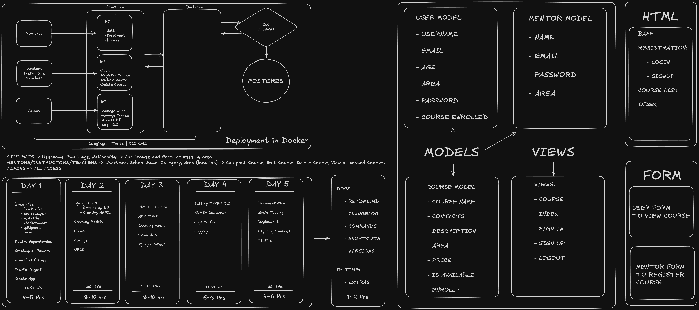

# Project Hub - Course Management System


A full-featured course HUB system with user authentication, course enrollment, and administrative tools using CLI.

## Features

### Core Functionalities
- **User Authentication System**
  - Signup with automatic group assignment (Student)
  - Login/Logout functionality
  - Role-based access control
- **Course Management**
  - Create/Read/Update/Delete courses
  - Course enrollment system
  - Student-Mentor relationship management
  - Feature for enrollment management
- **Dashboard Views**
  - Students: View enrolled courses
  - Mentors: Manage created courses
- **Administration**
  - Custom CLI for user management
  - Automated group assignments
  - Database management interface

### Technical Highlights
- Custom Typer CLI integration
- PostgreSQL database support
- Pytest test suite with 85%+ coverage
- Django class-based views

## Installation 🛠️
Run this commands to install, start the DB and start the app. After all is set,
  website will be available on: localhost:8000/admin for Django Administration and localhost:8000/ for the project UI/Website.

  Commands:
  - poetry install
      (All dependencies are store in the project.)
  - make compose up
      (Create the container for the DB, adminer and web service. Exposing 8000 port.)
  - make compose.start
      (Starting the server with a force rebuild. Making it accessible on localhost:8000/admin for Django Administration and localhost:8000/ for the project UI/Website and localhost:5432 for adminer access to access Postgres.)
  - make super
      (Despite the db file beeing in the project, you can create another superuser. Default one is User:admin | Pw:admin)
  - make test
      (Pytest views and models using detailed test.)
  - http://localhost:8000/
  - http://localhost:8000/admin
  - http://localhost:5432/

### CLI Commands for Admin use Only
- poetry run python manage.py cli super
- poetry run python manage.py cli create-user 
- poetry run python manage.py cli delete-user <username>
- poetry run python manage.py cli group-user <username> <groupname>
- poetry run python manage.py cli reset-group <username>
- poetry run python manage.py cli list-course
- poetry run python manage.py cli list-course --short
- poetry run python manage.py cli list-course --save


### Requirements 
- Python 3.12.9+
- Docker 4.39.0 for Container compatilibty using Debian Docker in Docker.
- PostgreSQL

### Dependencies
```toml
dependencies = [
    "django (>=5.1.7,<6.0.0)",
    "uvicorn (>=0.34.0,<0.35.0)",
    "psycopg2-binary (>=2.9.10,<3.0.0)",
    "typer (>=0.15.2,<0.16.0)",
    "whitenoise (>=6.9.0,<7.0.0)"
]
[tool.poetry.group.dev.dependencies]
pytest-django = "^4.10.0"
```

### How did I structured my project


### Project Structure
```projecthub/
├── .devcontainer/       
├── my_project/              
│   └── templates/          
├── my_course/       
│   ├── migrations/
│   ├── __init__.py
│   ├── admin.py
│   ├── apps.py
│   ├── forms.py
│   ├── models.py
│   ├── urls.py
│   └── views.py
├── static/   
├── projecthub/     
│   ├── settings.py
│   ├── urls.py
│   ├── asgi.py
│   └── wsgi.py
├── .env
├── compose.yaml
├── Dockerfile
├── manage.py
└── ...other root files ```
